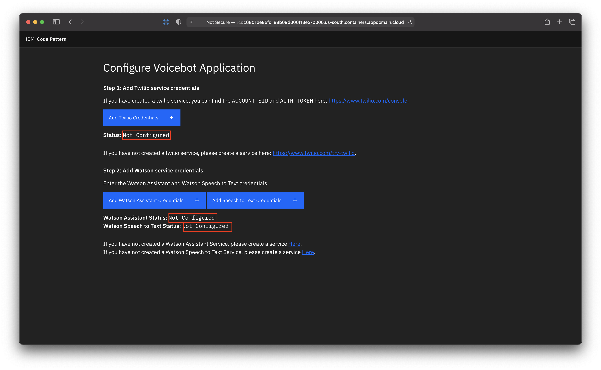
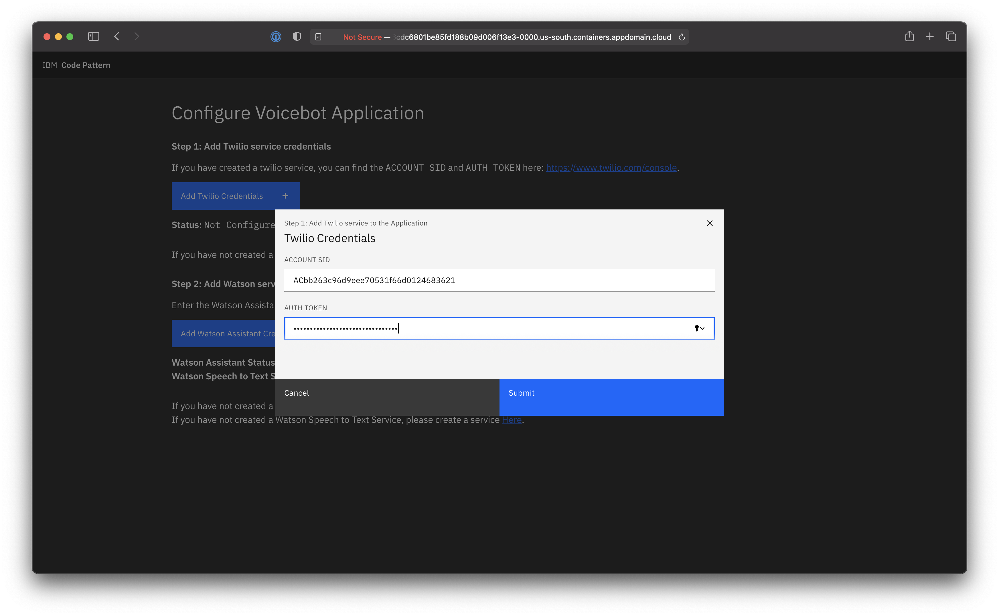
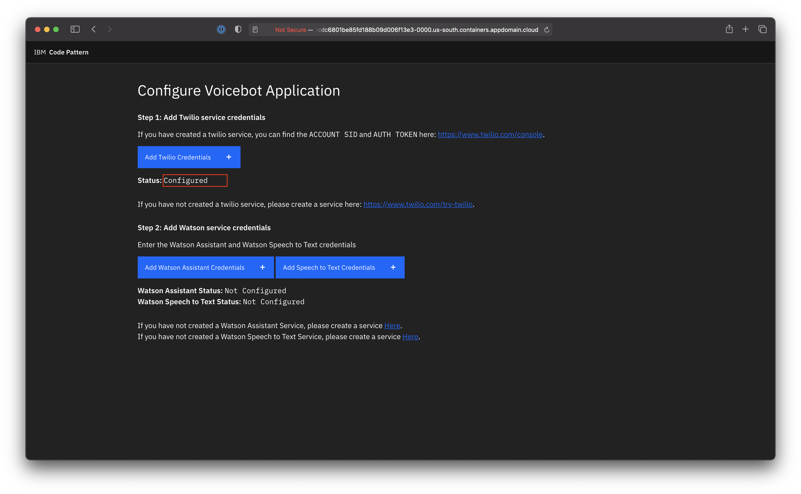
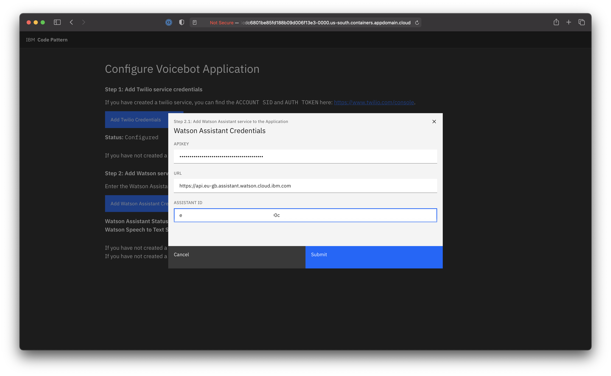
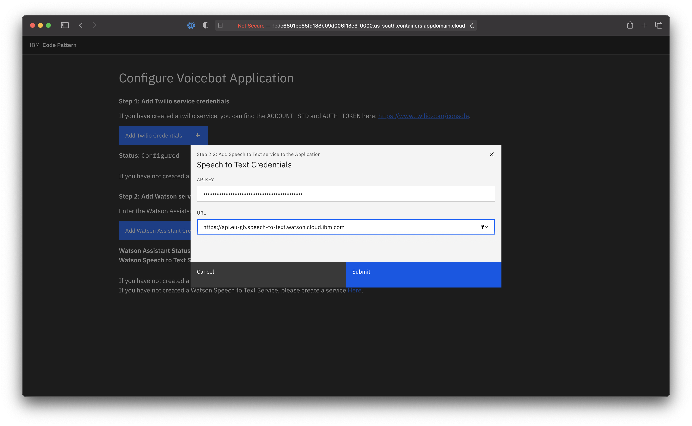
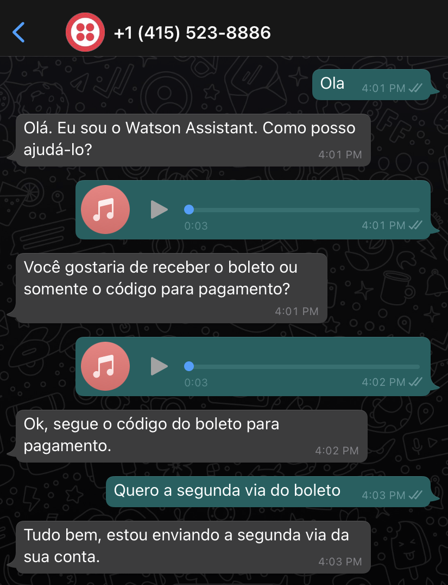

# Create a conversational Voicebot on WhatsApp with Watson services

Conversational AI VoiceBots are helping businesses automate repetitive and time-consuming queries. This gives your team more time to tackle more complex, high priority strategic tasks, while still ensuring that the customers are engaged. Voicebots take in voice input can ingest, analyze, interpret, and respond to customer inquiries, with the end goal of either being able to answer a customer’s question in real-time or being able to continue a textual exchange with the customer to clarify the question at hand. 

A Voicebot is useful in many scenarios where typing is not a convenient option:
- Elderly customers find it more convenient to speak than to type. Some customers have better spoken language skills than written language skills. They find it easier to use VoiceBots.
- Delivery executives on the move with a need to update systems.

In this code pattern, you will look a scenario of a customer who speaking `Brazilian Portuguese` interact with a customer care center with `WhatsApp`.
A framework is built using which the user will be able send queries using speech on WhatsApp, and then get a response from Watson Assistant. The query from the user is sent to the Watson Speech to Text service through a custom application. The output from the Watson Speech to Text service is then fed into Watson Assistant. Watson Assistant understands the query with the help of the built-in support for `Brazilian Portuguese` and responds back to the user with an appropriate reply. 

When you have completed this code pattern, you will understand how to:
* Use Watson Speech to Text service.
* Use Watson Assistant service.
* Integrate WhatsApp with Watson services.
* Handle queries sent over voice on WhatsApp. 

This code pattern can be configured to support multiple languages. Watson Assistant supports the following [languages](https://cloud.ibm.com/docs/assistant?topic=assistant-language-support).

<!--add an image in this path-->


<!--Optionally, add flow steps based on the architecture diagram-->
## Flow

1. User sends a voice or text message in WhatsApp
2. The message is redirected to Twilio Programmable messaging service
3. Twilio redirects the message to the Voicebot Application deployed on IBM Cloud or OpenShift
4. If the user has sent a voice message, the Voicebot Application leverages Watson Speech to Text to transcribe the message into text
5. The text message is sent to Watson Assistant
6. Watson Assistant chatbot detects the intent and replies with response accordingly
7. The Voicebot Application triggers the Twilio Programmable messaging service with the response message
8. Twilio Programmable messaging service redirects the response message to WhatsApp
10. User will be able to view the response message on WhatsApp

<!--Optionally, update this section when the video is created-->
# Watch the Video

<!-- [](https://www.youtube.com/watch?v=Jxi7U7VOMYg) -->

# Pre Requisites

1. [IBM Cloud Account](https://cloud.ibm.com/registration): Create an IBM Cloud account.
2. [IBM Cloud CLI](https://cloud.ibm.com/docs/cli?topic=cloud-cli-getting-started&locale=en-US): Download and Install IBM Cloud CLI tool.
3. [OpenShift ROKS Cluster](https://cloud.ibm.com/kubernetes/catalog/create?platformType=openshift): Create an OpenShift Cluster.
4. [OC CLI](https://docs.openshift.com/container-platform/4.6/cli_reference/openshift_cli/getting-started-cli.html): Download and Install OpenShift CLI tool.
5. [Git Client](https://git-scm.com/downloads): Download Git Client CLI.

# Steps

1. [Clone the repo](#1-clone-the-repo)
2. [Create Watson Services](#2-create-watson-services)
3. [Create Twilio service](#3-create-twilio-service)
4. [Build and Deploy the Voicebot Application](#4-build-and-deploy-the-voicebot-app)
5. [Configure Voicebot Application](#5-configure-voicebot-application)
6. [Try out voicebot on WhatsApp](#6-try-out-voicebot-on-whatsapp)

### 1. Clone the repo

Clone the `/voicebot-on-whatsapp-using-watson-services` repo locally. In a terminal, run:

```bash
git clone https://github.com/IBM//voicebot-on-whatsapp-using-watson-services.git
```
We will be using the following directory:

- `voicebot-app/` - To build and deploy the application.

### 2. Create Watson Services

Create the following Watson Services:
- Watson Speech to Text
- Watson Assistant

#### 2.1 Watson Speech to Text service
##### 2.1.1 Create service
Watson Speech to Text service can be created on IBM Cloud Pak for Data as well as on IBM Cloud. Follow the steps accordingly to create service in either of the platform.
<details><summary><b>IBM Cloud Pak for Data</b></summary>

- On Cloud Pak for Data, go to the **Service catalog** and deploy Watson Speech To Text Service, by clicking on the `Deploy` and following the instructions.

</details>

<details><summary><b>IBM Cloud</b></summary>

- On IBM Cloud, create a [Watson Speech To Text Service](https://cloud.ibm.com/catalog/services/speech-to-text), under `Select a pricing plan` select `Lite` and click on `create` as shown.

</details>

##### 2.1.2 Copy service credentials
- In Speech To Text Dashboard, Click on `Services Credentials`


- Click on `New credential` and add a service credential as shown. 


**NOTE:** Once the credential is created, copy and save the credentials in a text file for using it in later steps in this code pattern.

#### 2.2 Watson Assistant service
##### 2.2.1 Create service
Watson Assistant service can be created on IBM Cloud Pak for Data as well as on IBM Cloud. Follow the steps accordingly to create service in either of the platform.

<details><summary><b>IBM Cloud Pak for Data</b></summary>

- On Cloud Pak for Data, go to the **Service catalog** and deploy Watson Assistant Service by clicking on the `Deploy` and following the instructions.


</details>

<details><summary><b>IBM Cloud</b></summary>

- On IBM Cloud, create a [Watson Assistant Service](https://cloud.ibm.com/catalog/services/speech-to-text), under `Select a pricing plan` select `Lite` and click on `create` as shown.

</details>

##### 2.2.2 Copy credentials

<!-- - In Watson Assistant Dashboard, Click on `Services Credentials` and delete all the existing credentials. Create a new credential by clicking on `New credential`.


>Note: Deleting of existing credentials and creating a new service credentials is required because the `https://gateway-lon.watsonplatform.net` url is deprecated, on creating a new credential you should see an url like `https://api.eu-gb.assistant.watson.cloud.ibm.com`. -->

- In Watson Assistant Dashboard, Click on `Manage` and **Launch** the Watson Assistant.


- Click on **Create assistant** and give your assistant a name and create it.


- In Assistant dashboard, under **Dialog** click on **add dilog skill**.


- Select **Upload skill** and upload the `skill-Portugues-Assistant-Skill.json` skill present in [`/watson-assistant-skill/`](watson-assistant-skill/) directory.


- In Assistant dashboard, click on the three dots and select **Assistant settings**.


- Copy the `Assistant ID`, `Assistant URL` and `API key` as shown.


**NOTE:** Copy `Assistant ID`, `Assistant URL` and `API key` and save the credentials in a text file for using it in later steps in this code pattern.

### 3. Create Twilio service
Twilio is a SaaS offering that provides APIs to make and receive calls or text messages. As there are no APIs from WhatsApp directly availabe to send and receive WhatsApp messages programmatically, you will learn how to use Twilio's messaging service APIs that provides gateway to communicate with WhatsApp programmatically. Get started by creating a free Twilio service.

- Create a free Twilio service here: <https://www.twilio.com/try-twilio>.

>NOTE: - Once you create a Twilio service, you will have to verify your email id as well as your phone number.

>- You will receive verification link in the email provided during Twilio sign up. Go ahead and verify your email id.


- Once email id is verified you will be prompted to enter your phone number, submit that and you will get an OTP on your registered number, enter that back to verify.

    

- On successful verification you should see a welcome greeting message, additionally you will see some questions, select as described below.

    

    Questions|Answers
    --|--
    Which Twilio product are you here to use?| WhatsApp
    What do you plan to build with Twilio?| IVR & Bots
    How do you want to build with Twilio?| With code
    What is your preferred coding language?| Python
    Would you like Twilio to host your code?| No, I want to use my own hosting service

- Visit the Whatsapp section in Twilio <https://www.twilio.com/console/sms/whatsapp/sandbox>

- You will see a popup box reqsuesting you to **Activate Your Sandbox**, click on **I agree** checkbox and click **Confirm**.


- The sandbox for WhatsApp will appear, make a note of the `Sandbox Name` which will be prefixed with **join**, click on **Settings** on the left panel and select **WhatsApp Sandbox Settings**.
 

- In **WhatsApp Sandbox Settings** page, under **Sandbox Configuration**, there will be a field called **WHEN A MESSAGE COMES IN**, replace the existing URL in that field with the `URL` obtained by deploying the Voicebot Application from [Step 3](#3-build-and-deploy-the-voicebot-app), finally click on **Save** to save the configuration.


>NOTE: Sometimes the changes are not saved in Twilio WhatsApp Sandbox Settings even after clicking on save, reload the page to enusre the `URL` that you have entered in **WHEN A MESSAGE COMES IN** field is reflecting over there. If you still see the old URL over there then enter the `URL` from [Step 3](#3-build-and-deploy-the-voicebot-app) again and save it.

- Now the Voicebot Application is configured in Twilio, any message that you send from WhatsApp from this point will go to the Voicebot Application via Twilio WhatsApp Sandbox. However to reply back to you from WhatsApp the Voicebot Application needs to establish connection with Twilio.

- To establish connection between the Voicebot Application and Twilio we need to get the `account_sid` and `auth_token` from Twilio. 

- Visit <https://www.twilio.com/console> and expand the **Project Info** tab. You will see the `ACCOUNT ID` and `AUTH TOKEN`, copy it in some notepad as it will be used in [Step 5](#5-configure-credentials).
 

- At this point, you should have the `Sandbox Name`, `account_sid` and `auth_token` from Twilio service.

### 4. Build and Deploy the Voicebot Application
The Voicebot Application is an intermediator that connects Watson services and Twilio service. This application must be deployed in order to access it from Twilio WhatsApp Sandbox. You can either deploy the application on your OpenShift cluster or on any public hosting services like Cloud Foundry. Follow the documentation accordingly

<details><summary><b>Steps to Build and Deploy on OpenShift</b></summary>

<b>Note:</b> If you want to deploy the Voicebot Application without any modifications, you can skip the **Build** steps and directly follow the **Deploy** steps. If you want to make some modifications in the Voicebot Application and then deploy it then follow the **Build** step.

#### Build
> Note: Make sure you have docker cli installed and logged in to DockerHub

- In cloned repo, navigate to `voicebot-app/` directory and build the docker image. In terminal run:
```bash
$ docker build -t <your-docker-username>/voicebot-app:v1 .
```
> Replace `<your-docker-username>` with your docker hub username

- Once the docker image is built, store the docker image to Dockerhub. In terminal run:
```bash
$ docker push <your-docker-username>/voicebot-app:v1
```

- At this point you have built the container image and successfully pushed to to a container repository dockerhub. 

- Copy the image tag `<your-docker-username>/voicebot-app:v1` and replace it on line no `18` in `voicebot-app/deploy.yaml`

<pre><code>spec:
      containers:
      - name: voicebot-app
        image:<b> < your-docker-username >/voicebot-app:v1 </b>
        ports:
        - containerPort: 8080
</code></pre>


#### Deploy

- Login to your OpenShift cluster, In terminal run:
```bash
$ oc login -u <username> -p <password>
```

- Alternatively you can also login with an auth token. Follow the [Step here](https://developer.ibm.com/tutorials/configure-a-red-hat-openshift-cluster-with-red-hat-marketplace/#4-connect-to-the-openshift-cluster-in-your-cli) to login through an auth token.

- Once you have logged into OpenShift from your terminal, you can run the `oc apply` command to deploy the application on OpenShift. From within the `voicebot-app/` directory, in terminal run:
```bash
$ cd voicebot-app/
$ oc apply -f deploy.yaml
```

```
deployment.apps/voicebot-app created
service/voicebot-app-service created
route.route.openshift.io/voicebot-app-url created
```

- A deployment, service and a route will be created. To access the App, In terminal run:
```bash
$ oc get route -n default
```

```
NAME           HOST/PORT                                                                                                           PATH   SERVICES           PORT   TERMINATION   WILDCARD
voicebot-app-url   voicebot-app-url-default.xxx.us-south.containers.appdomain.cloud   /      voicebot-app-service   8080                 None
```

- You will see the `PATH` for with service name `voicebot-app-url`.
- Make a note of this url, as it will be used in step 4.

>Example: http://voicebot-app-url-default.xxx.us-south.containers.appdomain.cloud

- At this point, you will have successfully deployed the voicebot app on OpenShift. Now lets access it and see how it looks like.

</details>

<details><summary><b>Steps to Build and Deploy on IBM Public Cloud Foundry</b></summary>

#### Build and Deploy

- Before you proceed, make sure you have installed [IBM Cloud CLI](https://cloud.ibm.com/docs/cli?topic=cloud-cli-getting-started&locale=en-US) in your deployment machine.

- From the cloned repo, goto **voicebot-app** directory in terminal, and run the following commands to deploy the Application to IBM Cloud Foundry.

    ```bash
    $ cd voicebot-app/
    ```

* Log in to your IBM Cloud account, and select an API endpoint.
    ```bash
    $ ibmcloud login
    ```

    >NOTE: If you have a federated user ID, instead use the following command to log in with your single sign-on ID.

    ```bash
    $ ibmcloud login --sso
    ```

* Target a Cloud Foundry org and space:
    ```bash
    $ ibmcloud target --cf
    ```

* From within the _voicebot-app_ directory push your app to IBM Cloud.
    ```bash
    $ ibmcloud cf push otp-api
    ```

- The [manifest.yml](voicebot-app/manifest.yml) file will be used here to deploy the application to IBM Cloud Foundry.

- On Successful deployment of the application you will see something similar on your terminal as shown.
<pre><code>
Invoking 'cf push'...
Shown below is a sample output
    
Pushing from manifest to org abc@in.ibm.com / space dev as abc@in.ibm.com...
    
...
    
Waiting for app to start...
    
    name:              voicebot-app
    requested state:   started
    routes:            <b>voicebot-app.xx-xx.mybluemix.net </b>
    last uploaded:     Sat 16 May 18:05:16 IST 2020
    stack:             cflinuxfs3
    buildpacks:        python
    
    type:            web
    instances:       1/1
    memory usage:    512M
    start command:   python app.py
        state     since                  cpu     memory           disk           details
    #0   <b>running</b>   2020-05-16T12:36:15Z   12.6%   116.5M of 512M   796.2M of 1
</code></pre>

* Once the app is deployed, from the output of the above command, you can visit the `routes` to launch the application.

* Make a note of this url, as it will be used in step 4.

>Example: http://voicebot-app.xx-xx.mybluemix.net if deployed on IBM Cloud Foundry, http://voicebot-app-url-default.xxx.us-south.containers.appdomain.cloud if deployed on OpenShift

>Note: Add `http://` to the OpenShift url if not present.

- At this point, you will have successfully deployed the Voicebot app on IBM Cloud. Now lets access it and see how it looks like.

</details>

### 5. Configure Voicebot Application
Access the deployment URL created in previous step.
- You will see a configuration page as shown.

- You can see the **Status** of Twilio and Watson Services as **Not Configured**. Go ahead and click on **Add Twilio Credentials**. Enter the `ACCOUNT SID` and `AUTH TOKEN` copied in step 3.


- Once you submit, you will see the Status of Twilio service as **Configured**.


- Similarly click on **Add Watson Assistant Credentials**.Enter the `APIKEY`, `URL` and `ASSISTANT-ID` credentials copied in Step 2.


- Finally click on the **Add Watson Speech to Text Credentials**. Enter the `APIKEY` and `URL` copied in step 2.


- Once all the services are configured you will see a status as **Configured**.


- At this point you have successfully configured the Voicebot Application
### 6. Try out voicebot on WhatsApp

- In the voicebot app, you will see **View Application in Action** tab.


- Scan the QR code in your Phone to open the WhatsApp chat with Twilio's messaging API.

- A WhatsApp chat will open up in your phone with a typed code `join <sandbox name>`.

- Replace the `<sandbox name>` with your `Sandbox Name` obtained from [Step 4](#4-create-twilio-service) and send the message.

>NOTE: If you are unable to scan the QR code, save the phone number **+14155238886**, open WhatsApp and send a message to the saved number with code `join <sandbox name>`.

You can follow the workflow of the app as follows:
- User can send **Ola** or **Hi** to start a Watson Assistant session.

- The user can either send a voice message or send a text message through WhatsApp's chat functionality.

- The Watson Assistant will respond with textual reply accordingly.

    

## Summary

In this Code Pattern you learnt how to create a WhatsApp Chatbot that take in voice input and get a processed response from Watson Assistant. You also learnt how to use, Watson Assistant in conjunction with Watson Speech to Text. 

This code pattern can be extended to any language. 


## Questions

If you have any questions or issues you can create a new [issue here](https://github.com/IBM/voicebot-on-whatsapp-using-watson-services/issues).

Pull requests are very welcome! Make sure your patches are well tested.
Ideally create a topic branch for every separate change you make. For
example:

1. Fork the repo
2. Create your feature branch (`git checkout -b my-new-feature`)
3. Commit your changes (`git commit -am 'Added some feature'`)
4. Push to the branch (`git push origin my-new-feature`)
5. Create new Pull Request

## License

This code pattern is licensed under the Apache License, Version 2. Separate third-party code objects invoked within this code pattern are licensed by their respective providers pursuant to their own separate licenses. Contributions are subject to the [Developer Certificate of Origin, Version 1.1](https://developercertificate.org/) and the [Apache License, Version 2](https://www.apache.org/licenses/LICENSE-2.0.txt).

[Apache License FAQ](https://www.apache.org/foundation/license-faq.html#WhatDoesItMEAN)
