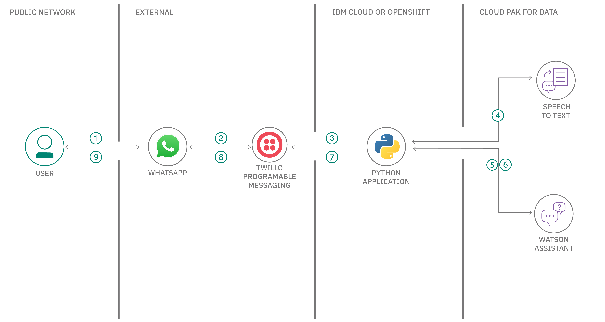
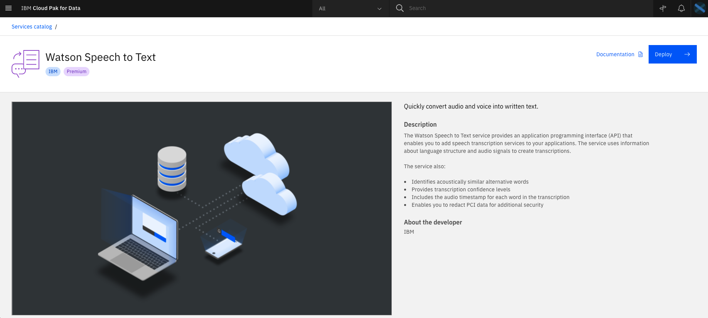

# voicebot-on-whatsapp-using-watson-services

Conversational AI VoiceBots are helping businesses automate repetitive, time-consuming queries and are giving your team more time to tackle more complex, high priority strategic tasks, while still ensuring that the customers are engaged. Chatbots that take in voice input can ingest, analyze, interpret, and respond to customer inquiries, with the end goal of either being able to answer a customer’s question in real-time or being able to continue a textual exchange with the customer to clarify the question at hand. 

In this code pattern, We will build a methodology using which the user will be able send his/her queries over voice on whatsApp and get a reply from Watson Assistant. The query from the user is sent to the Watson Speech to Text service through a custom application. The output from the Watson Speech to Text service is then feed to Watson Assistant. Watson Assistant replies back to the user with an appropriate reply. 

When you have completed this code pattern, you will understand how to:
* Use Watson Speech to Text service.
* Use Watson Assistant service.
* Integrate WhatsApp with Watson services.
* Handle queries sent over voice on WhatsApp. 

<!--add an image in this path-->


<!--Optionally, add flow steps based on the architecture diagram-->
## Flow

1. User sends a voice or text message in WhatsApp
2. The message is redirected to Twilio Programmable messaging service
3. Twilio redirects the message to the python application deployed on IBM Cloud or OpenShift
4. If the user has sent a voice message, the python application leverages Watson Speech to Text to transcribe the message into text
5. The text message is sent to Watson Assistant
6. Watson Assistant chatbot detects the intent and replies with response accordingly
7. The python application triggers the Twilio Programmable messaging service with the response message
8. Twilio Programmable messaging service redirects the response message to WhatsApp
10. User will be able to view the response message on Whatsapp

<!--Optionally, update this section when the video is created-->
# Watch the Video

<!-- [](https://www.youtube.com/watch?v=Jxi7U7VOMYg) -->

# Pre Requisites

1. [IBM Cloud Account](https://cloud.ibm.com/registration): Create an IBM Cloud account.
2. [IBM Cloud CLI](https://cloud.ibm.com/docs/cli?topic=cloud-cli-getting-started&locale=en-US): Download and Install IBM Cloud CLI tool.
3. [OpenShift ROKS Cluster](https://cloud.ibm.com/kubernetes/catalog/create?platformType=openshift): Create an OpenShift Cluster.
4. [OC CLI](https://docs.openshift.com/container-platform/4.6/cli_reference/openshift_cli/getting-started-cli.html): Download and Install OpenShift CLI tool.
5. [Git Client](https://git-scm.com/downloads): Download Git Client CLI.

# Steps

1. [Clone the repo](#1-clone-the-repo)
2. [Create Watson Services](#2-create-watson-services)
3. [Build and Deploy the Python Application](#3-build-and-deploy-the-python-application)
4. [Create Twilio service](#4-create-twilio-service)
5. [Try out voicebot on WhatsApp](#5-try-out-voicebot-on-whatsapp)

### 1. Clone the repo

Clone the `/voicebot-on-whatsapp-using-watson-services` repo locally. In a terminal, run:

```bash
git clone https://github.com/IBM//voicebot-on-whatsapp-using-watson-services.git
```
We will be using the following directory:

- `python-application/` - To build and deploy the application.

### 2. Create Watson Services

Create the following Watson Services:
- Watson Speech to Text
- Watson Assistant

#### Watson Speech to Text service
##### Create service
Watson Speech to Text service can be created on IBM Cloud Pak for Data as well as on IBM Cloud. Follow the steps accordingly to create service in either of the platform.
<details><summary><b>IBM Cloud Pak for Data</b></summary>

- On Cloud Pak for Data, go to the **Service catalog** and deploy Watson Speech To Text Service, by clicking on the `Deploy` and following the instructions.

</details>

<details><summary><b>IBM Cloud</b></summary>

- On IBM Cloud, create a [Watson Speech To Text Service](https://cloud.ibm.com/catalog/services/speech-to-text), under `Select a pricing plan` select `Lite` and click on `create` as shown.

</details>

##### Copy service credentials
- In Speech To Text Dashboard, Click on `Services Credentials`


- Click on `New credential` and add a service credential as shown. 


**NOTE:** Once the credential is created, copy and save the credentials in a text file for using it in later steps in this code pattern.

#### Watson Assistant service
##### Create service
Watson Assistant service can be created on IBM Cloud Pak for Data as well as on IBM Cloud. Follow the steps accordingly to create service in either of the platform.

<details><summary><b>IBM Cloud Pak for Data</b></summary>

- On Cloud Pak for Data, go to the **Service catalog** and deploy Watson Assistant Service by clicking on the `Deploy` and following the instructions.


</details>

<details><summary><b>IBM Cloud</b></summary>

- On IBM Cloud, create a [Watson Assistant Service](https://cloud.ibm.com/catalog/services/speech-to-text), under `Select a pricing plan` select `Lite` and click on `create` as shown.

</details>

##### Copy credentials

<!-- - In Watson Assistant Dashboard, Click on `Services Credentials` and delete all the existing credentials. Create a new credential by clicking on `New credential`.


>Note: Deleting of existing credentials and creating a new service credentials is required because the `https://gateway-lon.watsonplatform.net` url is deprecated, on creating a new credential you should see an url like `https://api.eu-gb.assistant.watson.cloud.ibm.com`. -->

- In Watson Assistant Dashboard, Click on `Manage` and **Launch** the Watson Assistant.


- Click on **Create assistant** and give your assistant a name and create it.


- In Assistant dashboard, under **Dialog** click on **add dilog skill**.


- Select **Upload skill** and upload the `skill-Portugues-Assistant-Skill.json` skill present in [`/watson-assistant-skill/`](watson-assistant-skill/) directory.


- In Assistant dashboard, click on the three dots and select **Assistant settings**.


- Copy the `Assistant ID`, `Assistant URL` and `API key` as shown.


**NOTE:** Copy `Assistant ID`, `Assistant URL` and `API key` and save the credentials in a text file for using it in later steps in this code pattern.

### 3. Build and Deploy the Python Application

#### 3.1: Build and Deploy on OpenShift
#### 3.2: Build and Deploy on IBM Cloud Foundry

### 4. Create Twilio service
Twlio is a SaaS offering that provides APIs to make and receive calls or text messages. As there are no APIs from WhatsApp directly availabe to send and receive WhatsApp messages programmatically, you will learn how to use Twilio's messaging service APIs that provides gateway to communicate with WhatsApp programmatically. Get started by creating a free Twilio service.

- Create a free Twilio service here: <https://www.twilio.com/try-twilio>.

>NOTE: - Once you create a Twilio service, you will have to verify your email id as well as your phone number.

>- You will receive verification link in the email provided during Twilio sign up. Go ahead and verify your email id.


- Once email id is verified you will be prompted to enter your phone number, submit that and you will get an OTP on your registered number, enter that back to verify.

    

- On successful verification you should see a welcome greeting message, additionally you will see some questions, select as described below.

    

    Questions|Answers
    --|--
    Which Twilio product are you here to use?| WhatsApp
    What do you plan to build with Twilio?| IVR & Bots
    How do you want to build with Twilio?| With code
    What is your preferred coding language?| Python
    Would you like Twilio to host your code?| No, I want to use my own hosting service

- Visit the Whatsapp section in Twilio <https://www.twilio.com/console/sms/whatsapp/sandbox>

- You will see a popup box reqsuesting you to **Activate Your Sandbox**, click on **I agree** checkbox and click **Confirm**.


- The sandbox for WhatsApp will appear, make a note of the `Sandbox Name` which will be prefixed with **join**, click on **Settings** on the left panel and select **WhatsApp Sandbox Settings**.
 

- In **WhatsApp Sandbox Settings** page, under **Sandbox Configuration**, there will be a field called **WHEN A MESSAGE COMES IN**, replace the existing URL in that field with the `URL` obtained by deploying the Python Application from [Step 3](#3-build-and-deploy-the-python-application), finally click on **Save** to save the configuration.


>NOTE: Sometimes the changes are not saved in Twilio WhatsApp Sandbox Settings even after clicking on save, reload the page to enusre the `URL` that you have entered in **WHEN A MESSAGE COMES IN** field is reflecting over there. If you still see the old URL over there then enter the `URL` from [Step 3](#3-build-and-deploy-the-python-application) again and save it.

- Now the Python Application is configured in Twilio, any message that you send from WhatsApp from this point will go to the Python Application via Twilio WhatsApp Sandbox. However to reply back to you from WhatsApp the Python Application needs to establish connection with Twilio.

- To establish connection between the Python Application and Twilio we need to get the `account_sid` and `auth_token` from Twilio. 

- Visit <https://www.twilio.com/console> and expand the **Project Info** tab. You will see the `ACCOUNT ID` and `AUTH TOKEN`, copy it in some notepad as it will be used in [Step 5](#5-configure-credentials).
 

- At this point, you should have the `Sandbox Name`, `account_sid` and `auth_token` from Twilio service.ss

### 5. Try out voicebot on WhatsApp


## Summary

In this Code Pattern you learned how to create a WhatsApp Chatbot that take in voice input and get a reply from Watson Assistant. We used WhatsApp, Watson Speech to text, Watson Assistant and a custom python application to build this solution.


## Questions

If you have any questions or issues you can create a new [issue here](https://github.com/IBM/voicebot-on-whatsapp-using-watson-services/issues).

Pull requests are very welcome! Make sure your patches are well tested.
Ideally create a topic branch for every separate change you make. For
example:

1. Fork the repo
2. Create your feature branch (`git checkout -b my-new-feature`)
3. Commit your changes (`git commit -am 'Added some feature'`)
4. Push to the branch (`git push origin my-new-feature`)
5. Create new Pull Request

## License

This code pattern is licensed under the Apache License, Version 2. Separate third-party code objects invoked within this code pattern are licensed by their respective providers pursuant to their own separate licenses. Contributions are subject to the [Developer Certificate of Origin, Version 1.1](https://developercertificate.org/) and the [Apache License, Version 2](https://www.apache.org/licenses/LICENSE-2.0.txt).

[Apache License FAQ](https://www.apache.org/foundation/license-faq.html#WhatDoesItMEAN)
